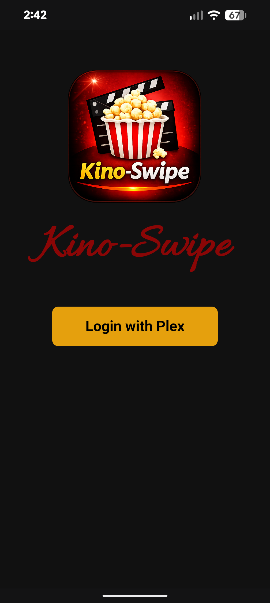
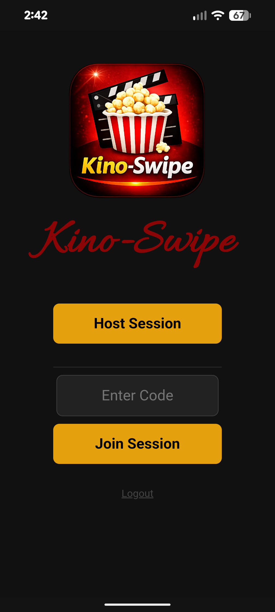
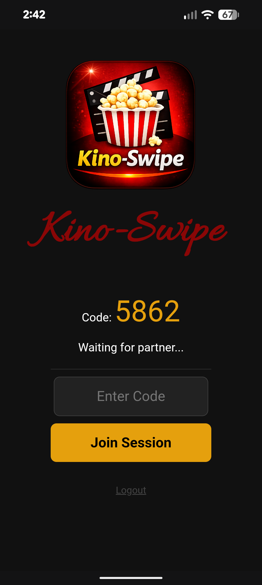
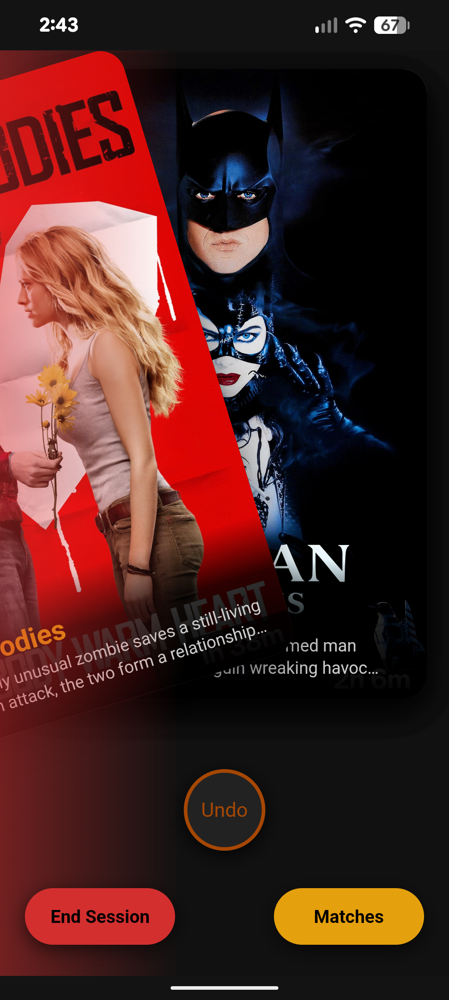
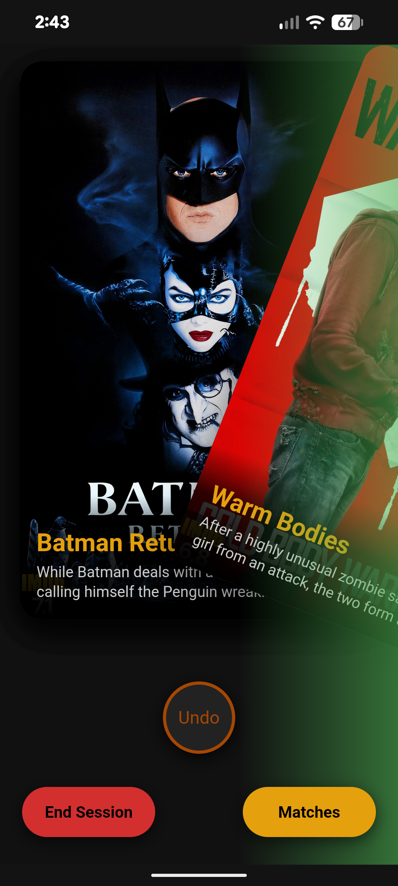
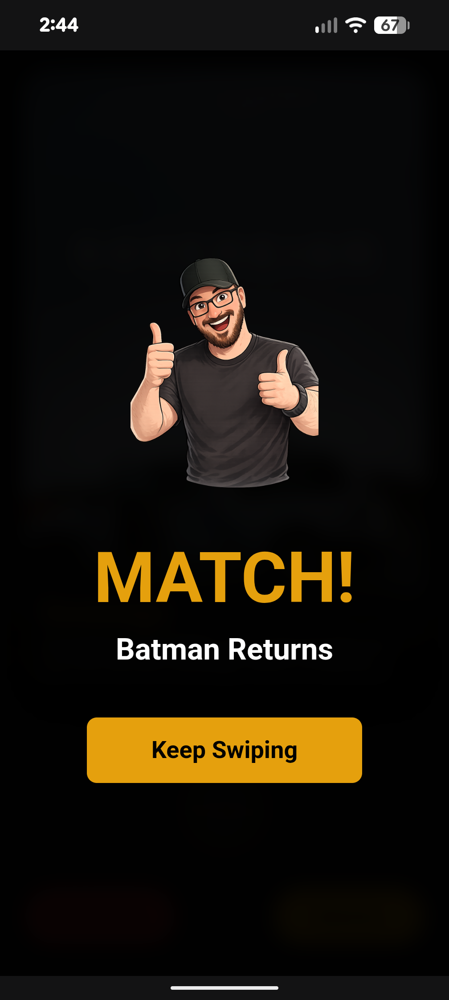
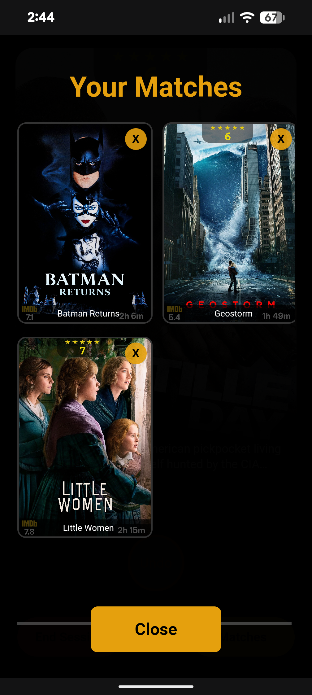
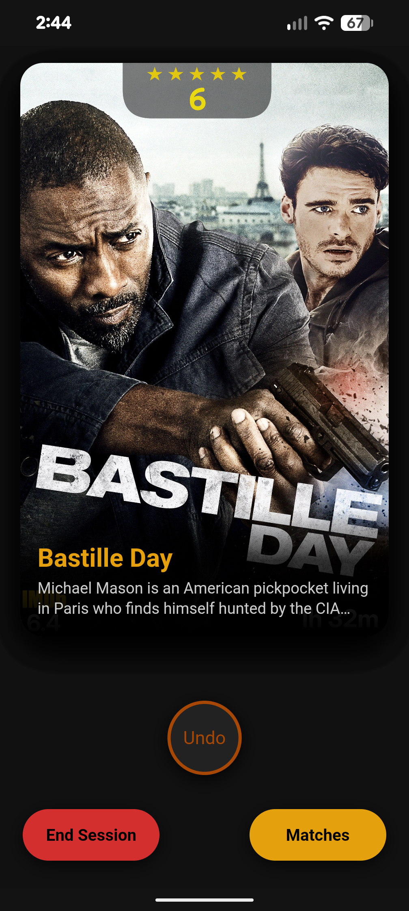

# Kino-Swipe 

Plex card-swiping for people who spend more time picking a movie than watching one.


## Screenshots
<p align="center">
  
  
  
  
  
  
  
  
  
</p>

## Features
- **Plex Integration:** Connects directly to your server to pull random movies.
- **Real-Time Sync:** Host a room, share a 4-digit code, and swipe with a partner instantly.
- **Visual Feedback:** Faint Red/Green "glow" overlays that react as you drag the posters left or right.
- **PWA Support:** Add it to your Home Screen for a native app feel.
- **Match Notifications:** Instant alerts when you both swipe right on the same movie.

## Requirements
- **Plex Media Server**
- **Plex Auth Token**
- **HTTPS/Reverse Proxy:** To "Install" the app as a PWA on your phone, you must access it over an HTTPS connection. If you use a local IP over HTTP, it will work in the browser but you won't see the install prompt.

---

## Deployment

### Option 1: Docker Run (Recommended)
Copy and paste this into your terminal. Replace the variables with your specific setup.

```bash
docker run -d \
  --name kino-swipe \
  -p 5005:5005 \
  -e PLEX_URL="https://YOUR_PLEX_IP:32400" \
  -e PLEX_TOKEN="YOUR_PLEX_TOKEN" \
  -v $(pwd)/data:/app/data \
  -v $(pwd)/static:/app/static \
  --restart unless-stopped \
  bergasha/kino-swipe:latest

Option 2: Docker compose
Add this to compose yaml.

services:
  kino-swipe:
    image: bergasha/kino-swipe:latest
    container_name: kino-swipe
    ports:
      - "5005:5005"
    environment:
      - PLEX_URL=https://YOUR_PLEX_IP:32400
      - PLEX_TOKEN=YOUR_PLEX_TOKEN
      - FLASK_SECRET=SomeRandomString
    volumes:
      - ./data:/app/data
      - ./static:/app/static
    restart: unless-stopped
